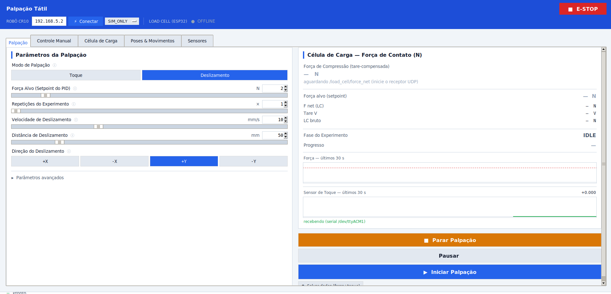
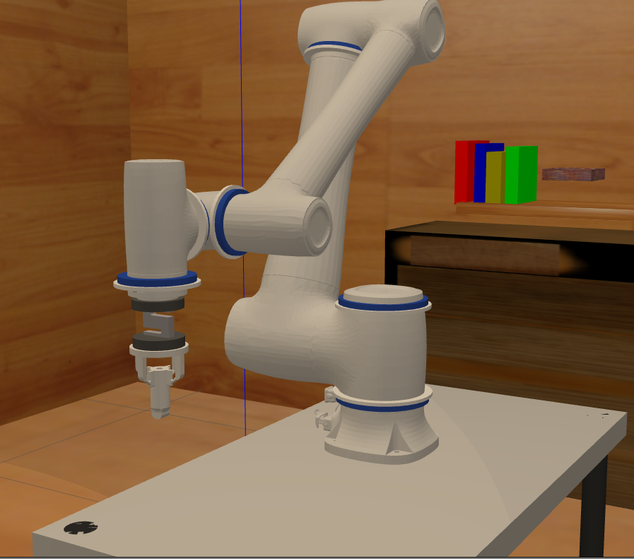
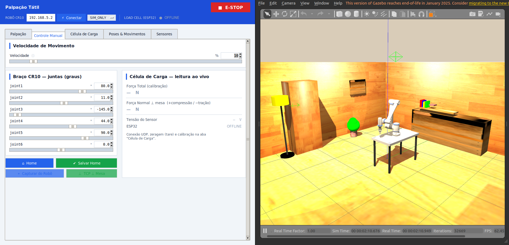
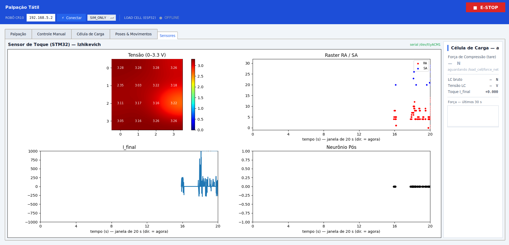
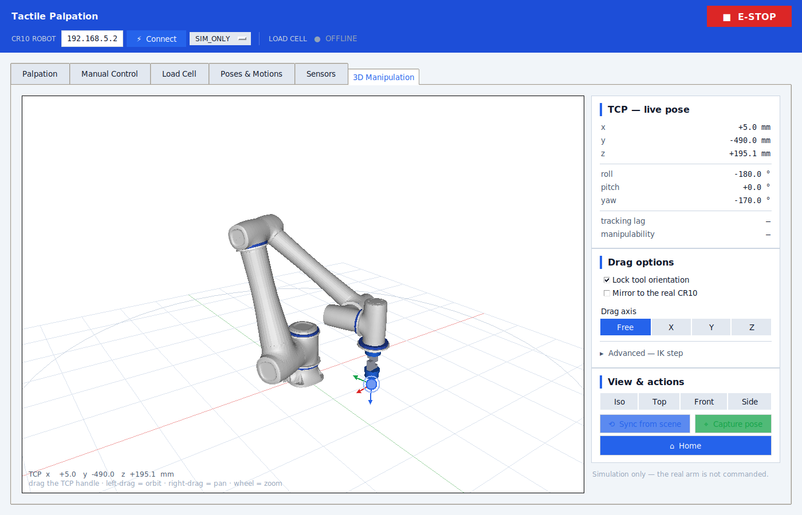
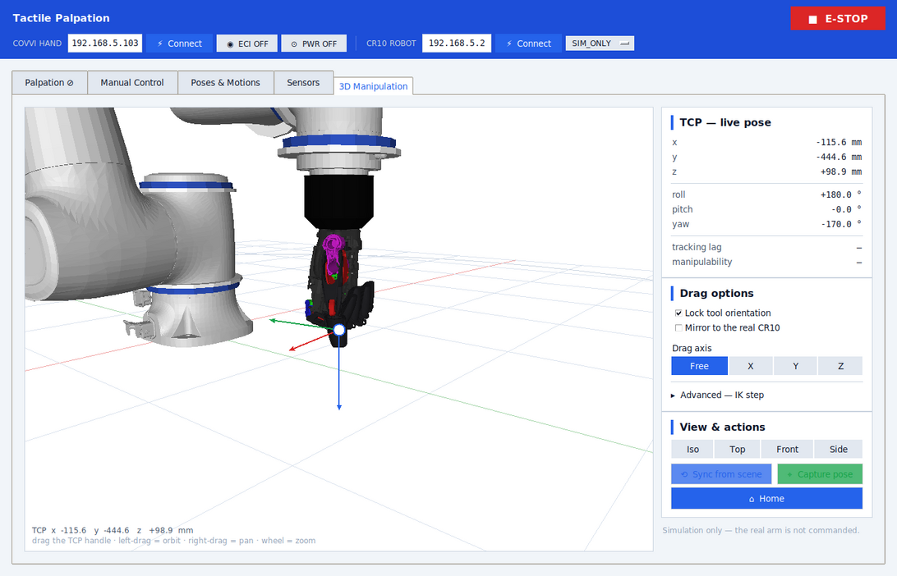
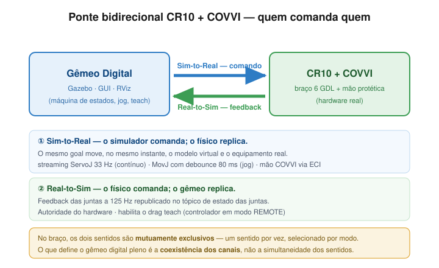
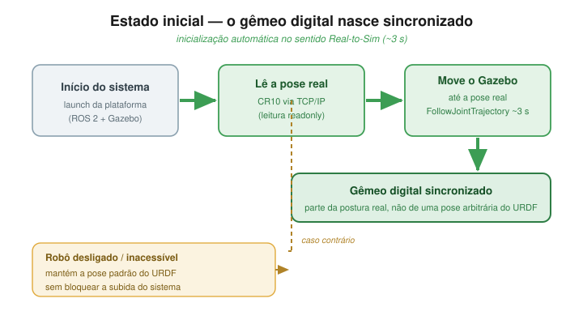
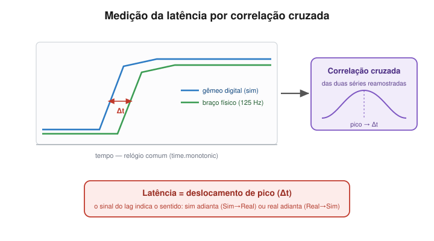

# touch_pack

**Tactile palpation** platform built on the CR10 arm and the printed palpation TCP (load cell + tip carrying the 5×5 tactile sensor) — or the Index finger of the COVVI hand. It reproduces the protocol of **Gupta et al. 2021** (approach to a target force, controlled force hold, Cartesian slide and retraction) either in **simulation (SIM_ONLY)** or **mirroring the real robot (MIRROR)**.

It also includes a **neuromorphic touch sensor (STM32, 4×4 array + Izhikevich model)**, **synchronized force + touch recording**, and two **operating modes**: **Touch** (presses with controlled force and returns) and **Slide** (full cycle with a lateral drag).

<p align="center">
  
  
</p>
<p align="center"><em>Left: the palpation scene in Gazebo Classic. Right: the <code>palpation_gui</code> — <strong>Palpation</strong> tab (Slide mode) with live readings from the load cell and the touch sensor.</em></p>

<p align="center">
  
  
</p>
<p align="center"><em>The real end effector: the <strong>100 kg load cell</strong> is bolted between the lower and upper printed couplers, with the TouchTool tip at the end — the physical counterpart of the <code>touch_tool</code> URDF chain (photos show the earlier 5 kg build in white; the current parts are all printed in blue). Any cell swap requires recalibrating in the GUI's <strong>Calibration</strong> tab.</em></p>

> The GUI is written in Portuguese. Where this README refers to on-screen labels, the original text is given in parentheses.

---

## Palpation modes

The GUI splits palpation into two modes (selector in the **Palpation** (`Palpação`) tab):

| Mode | Cycle executed | Purpose |
|---|---|---|
| **Touch** (`Toque`) | `HOME → DESCENDING → HOLD → RETRACT` (repeated **N touches**) | Press against the table with controlled force and return home — no sliding. The number of touches is selectable. |
| **Slide** (`Deslizamento`) | `HOME → DESCENDING → HOLD → SLIDING → RETRACT` | The full Gupta protocol cycle, with a lateral drag along ±X/±Y. |

Both modes repeat the cycle `repeats` times automatically (between repetitions the arm retracts and returns home).

### Modulated force (Touch mode)

In **Touch** mode the HOLD setpoint can follow a trigonometric profile instead of a constant force:
`F(t) = mean + amp·sin(2πf·t)`, with `mean`/`amp` derived from the requested range.
The wave runs as a position feedforward (`Δx = ΔF/K`, `K` measured during the descent) — the load
cell is read every tick for safety, not to close the loop on the wave.

No GUI control yet; set it on the running node (search the code for `GUI HOOK force-mod` for the
three places that expose it in the GUI):

```bash
ros2 param set /tactile_explorer force_mod_shape SINE   # OFF | SINE | COSINE
ros2 param set /tactile_explorer force_mod_min_n 2.0
ros2 param set /tactile_explorer force_mod_max_n 3.0
ros2 param set /tactile_explorer force_mod_hz 10.0
ros2 param set /tactile_explorer force_mod_cycles 20    # duration = cycles / hz
```

The instantaneous setpoint is published in `PalpationStatus.target_force_n` and the logger copies it
into the `setpoint_n` column of the samples CSV, next to the measured `force_net_n`. What that column
carries is the **delivered** wave, not the commanded one: it is reconstructed from the penetration
measured by FK (×K), because in MovL mode the command is accepted before it executes and the
commanded wave runs ahead of the executed one. That is what keeps the two columns aligned in time, so
the frequency you read from the CSV is the frequency actually delivered.

The status timer runs at 10 Hz, so `setpoint_n` is a staircase with 100 ms steps — enough to measure
the frequency of a wave up to ~4 Hz, but coarser than the 33 Hz control loop that generates it.

**Rate limit:** the control loop runs at 33 Hz (`_CTRL_DT = 30 ms`), so a faithful wave needs
`f ≤ ~4 Hz` (8 points per cycle). At 10 Hz there are ~3 points per cycle: the profile still runs and
is logged, but the commanded shape is coarse and the achieved amplitude falls short of the request.
The log warns with the numbers whenever that is the case.

---

## Protocol / FSM

```
IDLE → HOME → DESCENDING → HOLD → [SLIDING] → RETRACT → HOME → IDLE
```

| Phase | Description |
|---|---|
| **HOME** | Batch joint-space trajectory (JTC S-curve) at ≤ 0.3 rad/s to the initial pose. Checks that the TCP points downward. |
| **DESCENDING** | Jacobian streaming along the approach axis (TCP −Z) with a fast→slow profile. **Force controlled:** it ends when the compression reaches the *setpoint* (`force_n`). `depth_mm` is the **maximum safety** travel. |
| **HOLD** | A quasi-static micro-step regulator brings the compression to the setpoint and **waits for it to settle**: `\|Fz − target\| ≤ tol` for `hold_stable_s` continuous seconds (capped by `hold_timeout_s`). |
| **SLIDING** | (Slide mode only) Lateral Jacobian streaming along ±X/±Y at constant velocity with orientation/depth locking; on the normal axis the force is **not regulated** — only monitored for safety. |
| **RETRACT** | Cartesian retreat along +Z (opposite the approach) by `retract_mm`. |

Control runs through **direct streaming** at 33 Hz — no action server, no trajectory queue. Each setpoint is computed and published individually, which keeps latency minimal and makes `stop`/`pause` respond immediately.

**The setpoint is approached from below.** Every pushing micro-step is capped so that, projected through the *upper bound* of the local stiffness (`k_upper`), it cannot take the force past the **target** — not past the upper edge of the band. Until 27/08/2026 the cap aimed at `target + tol`, which made stopping a whole tolerance above the setpoint the *correct* behaviour of the law: against a 0.5 N target with the 4σ band that is +18 % of force into the sample, within spec and still wrong. The asymmetry is deliberate — crossing upward puts force into a sample that may be biological, staying below costs one tick — and it is cheap: measured on the synthetic F(x) curves of `test_no_overshoot.py`, the descent peak moved from "inside the band" to **below the setpoint** in every case at a cost of zero to one tick. **The first impact aims at the contact threshold**, not at the setpoint. The touch transient is `v · T_halt · K`, and `crawl_v_ms` sizes the crawl speed so that peak lands on `CONTACT_ON_N` (0.1 N) — the first contact *detects*, and the quasi-static regulator is what climbs from there to the setpoint. Until 27/08/2026 the budget was `target + tol`, so the impact had licence to deliver the whole setpoint on its own, before any loop could react: against a 5 N run that is a 5 N blow to the sample. The peak no longer depends on the setpoint — 0.2 N and 5 N touch with the same force. **This costs descent time**, because `v` is linear in the budget: against the rigid reference tip a 1.6 N run crawled at the 200 µm/s ceiling and now crawls at ~12 µm/s, and without a learned contact the *whole* descent runs at that speed (4.5 mm of free travel goes from 22 s to 378 s). On soft contacts nothing changes — both budgets clip at the ceiling. The lever is `T_halt`: the 0.3 s in the formula is borrowed from the braking constant and **was never measured**; `v` is linear in `1/T_halt`, so at the ~85 ms measured elsewhere in the chain the crawl returns to ~42 µm/s. `latency_probe.py` is the instrument.

**Force safety:** by convention compression is **positive** and traction is negative. A measurement is **aborted** if the compression exceeds **15 N** (`FORCE_ABORT_LIMIT_N`); the force setpoint is saturated at **10 N**. If the load-cell reading goes stale (> 0.5 s), the force phases abort (`stale`).

---

## Nodes

| Executable | Role |
|---|---|
| `tactile_explorer` | Palpation FSM: subscribes to `/palpation/start`, runs the cycle (Touch/Slide mode), publishes `/palpation/status` |
| `palpation_gui` | Tkinter GUI: parameters, modes, manual control, load-cell calibration, poses/motions, touch-sensor dashboard |
| `palpation_logger` | Writes one CSV + JSON per run into `sensors/Data/` |
| `palpation_report` | Generates a per-cycle statistical report from the run CSVs |
| `force_receiver` | **Default.** Reads the **axial 100 kg cell** on the XIAO ESP32S3 over **USB serial** (sole owner of the port) → `/load_cell/voltage`, `/load_cell/force`, `/load_cell/force_net`, `/load_cell/calibrated`; relays `/load_cell/rezero` as `'Z'` |
| `ft_receiver` | Reads the **FA7155 6-axis cell** over RS485/USB (sole owner of the port) → `/ft_sensor/wrench` (all six channels) plus the same `/load_cell/*` contract the modulation loop consumes. Alternative to `force_receiver`; **never run both** |
| `touch_receiver` | Receives UDP from the touch-sensor plotter (port **8081**) → `/touch_sensor/value` |
| `force_sync` | Pairs force × touch by arrival → `/touch_sync/data` (`SyncedTouch`), one message per load-cell sample |
| `mirror_node` | Mirrors sim → real CR10 **without the GUI** (covers `no_gui:=true` in MIRROR) |
| *(module)* `manip3d` | Viewport 3D + differential IK of the **3D Manipulation** tab — no ROS, no node |
| *(module)* `urdf_scene` | Loads the cell's URDF + meshes into the triangle scene that viewport renders |
| *(module)* `vtk_render` | Optional GPU backend — renders the URDF mesh at full resolution, offscreen |
| `real_pose_sync` | Moves the simulated arm to the real robot's pose at startup (single use in the launch) |

---

## How to run

```bash
source install/setup.bash

# Full cell (Gazebo + CR10 + GUI + logger + force_rx + touch_rx)
ros2 launch touch_pack tactile_cell.launch.py

# Tactile tip + load cell (unlocks the Palpation tab) and mirroring of the real robot
ros2 launch touch_pack tactile_cell.launch.py \
    end_effector:=touch_tool \
    control_mode:=mirror \
    robot_ip:=192.168.5.2

# Headless (no Tkinter GUI) — mirror_node takes over the mirroring
ros2 launch touch_pack tactile_cell.launch.py control_mode:=mirror no_gui:=true
```

<p align="center">
  
</p>
<p align="center"><em><code>end_effector:=touch_tool</code> in <code>worlds/research_lab.world</code> — the arm carries the contact tip instead of the COVVI hand, which is what unlocks the Palpation tab.</em></p>

### Launch arguments

| Argument | Default | Values |
|---|---|---|
| `end_effector` | `hand` | `hand` (COVVI hand control) · `touch_tool` (palpation TCP: load cell + tip with the 5×5 sensor) |
| `control_mode` | `sim_only` | `sim_only` · `mirror` · `real_from_sim` |
| `robot_ip` | `192.168.5.2` | IP of the real CR10 controller |
| `no_gui` | `false` | `true` = no Tkinter (uses `mirror_node` in MIRROR) |
| `force_sensor` | `load_cell` | `load_cell` (axial 100 kg on the XIAO+HX711 — **the cell on the bench**) · `ft6` (FA7155 6-axis over RS485) |
| `lc_port` | *(empty)* | USB port of the XIAO (`/dev/ttyACM0`). Empty = auto-detect by the Espressif VID |
| `ft_port` | *(empty)* | Port of the USB↔RS485 converter (`COM5`, `/dev/ttyUSB0`). Empty = auto-detect by VID |

> The **Palpation** tab/mode is only active with `end_effector:=touch_tool` (it needs the load cell). With `hand` the GUI shows the hand controls instead.

---

## GUI (`palpation_gui`)

A notebook with 6 tabs: **Palpation** (`Palpação`) · **Manual Control** (`Controle Manual`) · **Load Cell** (`Célula de Carga`) · **Poses & Motions** (`Poses & Movimentos`) · **Sensors** (`Sensores`) · **3D Manipulation** (`Manipulação 3D`).

### Palpation tab
- **Mode selector**: Touch / Slide (shows or hides the slide parameters).
- **Target force** (force setpoint, 1–10 N, integer) · **Repetitions / Number of touches**.
- **Slide** (that mode only): velocity (mm/s), distance (mm), direction ±X/±Y.
- **Advanced** (collapsible): max descent depth, and HOLD settling (band tolerance, stable window, timeout) plus the quasi-static micro-step ceilings.
- Live **load-cell** reading + a force sparkline.
- **Start / Stop / ⏸ Pause** buttons and **Save data (force+touch)**.
- Parameters persist between sessions (including the selected mode).

### Manual Control tab
- 6 CR10 arm sliders + (in `hand` mode) 6 COVVI hand sliders.
- Open / Point / Close presets · SpeedFactor (%) · trajectory duration.
- Home button and custom-Home saving · load-cell mini panel.

<p align="center">
  
</p>
<p align="center"><em><strong>Manual Control</strong> tab next to Gazebo: jogging the 6 CR10 joints with the load cell read live (jog uses <code>MovJ</code> when in MIRROR).</em></p>

### Load Cell tab

The tab shows **the cell that is on the cable** — `force_sensor` reaches the
GUI as a parameter, the same argument that picked the receiver, so the panels
and the data can't come from different cells. Only the selected cell's sub-tabs
are built: with the S-beam on the cable, a 6-axis panel would show six
convincing zeros (nobody publishes `/ft_sensor/wrench`) and read as a dead cell.

**`force_sensor:=load_cell`** — axial 100 kg (default):
- **Reading**: net force (the number the explorer regulates and the 15 N abort
  watches) on a 0…15 N bar with a tick at the contact threshold, plus the three
  stages side by side — bridge voltage → force before tare → force after tare.
  The gap between the last two *is* the current zero, which is how you catch
  drift without unloading the tip. Board status, measured rate and whether the
  receiver has a calibration loaded. Both zeros are here, named: **Tare (host)**
  and **Re-zero the firmware ('Z')**.
- **Calibration**: a wizard that **opens with the calibration in force already
  loaded** — V₀, the points that produced it and the line itself, read from
  `sensors/load_cell_calib.json`. Capture mass `0` with the cell empty to set
  V₀, then one point per standard mass; *Clear points* starts a fresh set.
  The fit adjusts **only the slope**, holding V₀ at the measured zero, and
  writes that same file.

**`force_sensor:=ft6`** — FA7155:
- **6 Axes**: the six live channels, link health, Modbus command panel, charts,
  filter, statistics and recording. No calibration wizard — the FA7155 is
  factory-calibrated.

### Poses & Motions tab
- **Capture a pose** from the real robot (feedback port) or from Gazebo (`/joint_states`).
- **Drag Teach**: releases the real arm (`DragTeachSwitch`); Gazebo mirrors the manual motion at 33 Hz; drag is detected automatically from joint movement.
- **Motions**: sequences of N poses + a velocity → interpolated in Gazebo and paced as `MovJ` on the real arm (MIRROR).
- Persisted in `~/.config/touch_pack/poses.json`.

### Sensors tab
A dashboard for the **touch sensor (STM32, Izhikevich)** with 4 embedded matplotlib plots:
**voltage heatmap (4×4)** · **RA/SA raster** (5 s sliding window) · **I_final** · **postsynaptic neuron**, alongside the live load-cell reading.
Rendered with **blitting** (`FuncAnimation` @ 20 Hz) — only the artists that change are redrawn, and it pauses when the tab is not visible (no freezing, the raster scrolls smoothly).

<p align="center">
  
</p>
<p align="center"><em><strong>Sensors</strong> tab: 4×4 voltage heatmap, RA/SA raster, <code>I_final</code> current and the postsynaptic neuron response (Izhikevich), read from the STM32 over USB-CDC.</em></p>

### 3D Manipulation tab
Interactive 3D posing: **drag the TCP with the mouse** and the arm follows, with the inverse kinematics solved live.

<p align="center">
  
</p>
<p align="center"><em><strong>3D Manipulation</strong> with <code>end_effector:=touch_tool</code>: the CR10 drawn from <code>cra_description</code>'s own STLs, the printed palpation stack on the flange, and the draggable handle on the TCP.</em></p>

**The model is the robot, not a stand-in.** The viewport renders the *same URDF the Gazebo spawn got* — same meshes, same joint offsets, same material colours. The launch hands its `full_urdf` file to the GUI through the `robot_description_path` parameter; run standalone, `urdf_scene.py` calls the launch's own `_build_robot_urdf()` so the two can't drift. (`/robot_description` is deliberately **not** used: `robot_state_publisher` gets the *minimal* URDF, with `<visual>` stripped by regex.)

So the CR10 arrives with its six link meshes and blue accent rings; `touch_tool` adds the printed stack (robot coupler → 100 kg S-cell → tool coupler → touch tool → tip → 5×5 sensor pad); `hand` adds the prosthesis coupler and the full COVVI hand, whose fingers **articulate live** from `/joint_states` — the URDF's `<mimic>` joints drive the 25 secondary links off the 6 primary ones, exactly as in the sim.

<p align="center">
  
</p>
<p align="center"><em>The same tab with <code>end_effector:=hand</code>, zoomed onto the end effector: the black prosthesis coupler and the COVVI hand with its fingers curled, driven live by the hand controller. The TCP handle sits at the grasp point of <code>kinematics.T_HAND_ATTACH</code> — a convention, not a URDF link, which is why it floats just past the fingertips.</em></p>

Grab the round handle on the TCP and drag it; the ground grid carries the 1375 mm reach circle.

#### Rendering backends

The mesh you see is drawn by the best backend available, and it degrades cleanly:

| Backend | Geometry | Cost per frame | When |
|---|---|---|---|
| **GPU** (`vtk_render.py`, VTK offscreen) | **the URDF mesh, exact** — no decimation at all | ~13 ms | VTK importable **and** a GL context exists |
| **CPU** (`manip3d.py`, PIL painter's algorithm) | decimated to a ~5000-triangle budget (finer still, coarser while dragging) | ~10–34 ms | no VTK / no GL |
| **Skeleton** (`tk.Canvas` lines) | FK joint origins only | <1 ms | no PIL, or meshes unreadable |

The GPU path is what makes "identical to Gazebo" literal: **62 588 triangles** for `touch_tool` and **420 042** for `hand` — every triangle of every STL — rendered offscreen and blitted into the same canvas, with the TCP handle, drag target and HUD staying as crisp Tk vector items on top. Software rasterisation *cannot* do that (the same 420 k triangles cost ~1.15 s per frame in PIL), which is why the CPU backend decimates instead.

> The vtkCamera is built to match `manip3d.Camera.project` term for term, because that projection is what places the TCP handle and resolves the click on it. `test_vtk_render.py` renders a marker at known world points and asserts the drawn pixel lands within **1.5 px** of the predicted one, across camera poses and after a resize — if the two projections ever drift, the handle would float beside the tool and the drag would grab the wrong place.

VTK is an **optional** dependency: `python3-vtk9` on Ubuntu 22.04 (already pulled in by several ROS desktop stacks). Without it nothing breaks — the tab just runs on the decimated CPU backend.

| Mouse | Action |
|---|---|
| Left drag **on the TCP handle** | Moves the TCP (runs the IK) |
| Left drag anywhere else | Orbits the camera |
| Right / middle drag | Pans |
| Wheel | Zooms |

**How the drag is solved.** The depth of the TCP is frozen at the moment of the click, so the mouse travels on the plane parallel to the screen that contains the TCP — 1 px is always the same distance in metres for the whole drag, with no scale drift. The resulting Cartesian target is chased by **differential IK**: damped least squares (DLS, λ = 0.06) over the closed-form geometric Jacobian of `kinematics.jacobian`, 6 iterations per **33 Hz** tick — the same rate as the explorer's Cartesian streaming. Each tick publishes one `JointTrajectory` point with a 100 ms horizon to `/cr10_group_controller/joint_trajectory`, and the Manual Control sliders stay in sync.

> Why not `kinematics.inverse_kinematics`: the full solver sweeps ~16 seeds × 300 iterations looking for the best *global* solution. It costs tens of ms and, worse, it can jump between elbow/wrist branches from one frame to the next — the arm would snap mid-drag. The differential step always starts from the current pose, so it is continuous by construction and runs in tens of µs.

Panel options:

| Control | Effect |
|---|---|
| **Lock tool orientation** (default **on**) | The mouse moves the *point*; the wrist works to preserve the current TCP attitude. Unchecking frees the wrist — looser, but it reaches further before hitting a joint limit. |
| **Mirror to the real CR10** (default **off**) | Off, the drag moves **only** the simulated arm. On (and in MIRROR), the pose reached is sent as `MovJ` when the drag settles — the 80 ms debounce means the hardware follows the *result* of the drag, not every frame of it. |
| **Drag axis** — Free / X / Y / Z | Free = the camera plane. X/Y/Z projects the motion onto that world axis (e.g. descend in Z without drifting sideways). |
| **Advanced** — max linear step (mm) · max joint step (°) | Ceilings per IK iteration: they limit the TCP velocity and keep the pose continuous near a singularity. |

Live readout of the TCP (x/y/z in mm, roll/pitch/yaw in degrees), the **tracking lag** (how much the IK still owes the cursor) and the **manipulability** (Yoshikawa) — the HUD flags a singular Jacobian, a joint limit or an out-of-reach target. **Capture pose** saves the pose straight into the *Poses & Motions* tab; **Sync from scene** pulls the current pose back from `/joint_states`.

Same gates as the joint jog: the drag is blocked during palpation (the explorer is streaming on the same JTC topic), during **drag teach** (the real arm's motors are released) and while a motion is running — and if a gate *closes mid-gesture* the drag is aborted rather than left spinning the IK against a blocked publisher. The 3D drag can never switch drag teach on: the auto-detector only arms on movement measured on the **real** arm with no PC command outstanding, and with mirroring off nothing is ever sent there.

**Frame budget.** The meshes are read and prepared once, in a background thread (≈1 s), while the skeleton stands in. On the GPU backend the exact mesh holds **~13 ms/frame** in both end-effector modes, so the drag runs at the full 33 Hz with nothing simplified. On the CPU backend two levels of detail are kept — the full budget when the view is still, a coarser one while you drag or orbit. Either way the IK and the JTC publish always run at 33 Hz regardless of what the picture costs: if a frame overruns, the renderer drops frames instead of slowing the arm.

### Header
- Hand and CR10 arm IPs + Connect/Disconnect · SIM_ONLY ↔ MIRROR dropdown · ECI ON/OFF · PWR ON/OFF · E-STOP.

---

## Touch sensor (STM32)

A **4×4 taxel** array read over USB-CDC (115200 baud, ACM/USB port auto-detection). The firmware emits voltages, RA/SA *spikes* (neuromorphic model) and the final current `I_final` of the postsynaptic neuron (**Izhikevich** model).

- `touch_source.py` (`TouchSensorSource`) reads the serial port directly on the GUI's PC and feeds the **Sensors** tab; it publishes `/touch_sensor/value` (throttled to 100 Hz).
- Without a local serial port, `touch_receiver` receives the reading relayed over UDP (port **8081**) and publishes the same `/touch_sensor/value` — the GUI falls back to that mode automatically.

---

## Force × touch synchronization

`force_sync` pairs the latest fresh sample of `/load_cell/force` with the latest of `/touch_sensor/value` and publishes `touch_pack_msgs/SyncedTouch` on `/touch_sync/data` at **50 Hz** (the load cell's own rate). Each pair carries `load_cell_age_ms` / `touch_age_ms` so the synchronization quality can be assessed *a posteriori*.

---

## Where the data is saved

Everything goes to **`<repo_root>/sensors/Data/`** (override with the `TOUCH_PACK_DATA_DIR` environment variable). The directory is located automatically by walking up from the package until `sensors/` is found — this works both when running from `src/` and from `install/`.

**One folder per mode, one per run** — every file of a sample lands together:

```
sensors/Data/
├── MATRIX_MAP/
│   └── 20260812_143012/     ← run_id: wall clock at Start, stamped by the GUI
│       ├── samples.csv          sensors.csv      matrix.csv
│       ├── adc.csv              spikes.csv       cuneiformes.csv
│       └── params.json          summary.json     plot.png
├── TOUCH/ · SLIDE/ · MANUAL/    same structure
├── RECORDING/                   GUI Record button pressed outside a run
└── latency/                     latency_probe captures
```

The `run_id` travels in the `PalpationStart` message so that the logger and the GUI — which write different files of the same run — agree on the folder. It is **wall-clock**, not the ROS clock: under `use_sim_time` the ROS clock restarts from zero on every launch, which used to name every run `19691231_*` and silently overwrite the previous session's data.

| File | Source | Contents |
|---|---|---|
| `samples.csv` | `palpation_logger` | `t_rel_s, t_unix, cycle, phase, setpoint_n, force_net_n, q1..q6, tcp_x/y/z, wp_index, wp_x_mm, wp_y_mm, taxel_0..taxel_24, n_RA, n_SA, cn_mm, cn_ra, cn_sa` — one row per sample |
| `matrix.csv` | `palpation_logger` | **MATRIX_MAP only** — one row per finished indentation (see below) |
| `params.json` | `palpation_logger` | parameters from `/palpation/start`, including the `run_id` (read by `palpation_report`) |
| `summary.json` · `plot.png` | `palpation_report` | post-run metrics per cycle/phase, and force×time coloured by phase |
| `sensors.csv` | the GUI, at Start (or its **Record data** button) | 1 kHz stream: net force, raw LC, LC voltage, `touch_i_final` and the taxel voltages (`v00..v44`) |
| `adc.csv` · `spikes.csv` · `cuneiformes.csv` | the GUI | raw firmware lines, same format as the standalone collection plotter |

Runs collected before this layout stay loose in the root of `sensors/Data` with the old names (`<ts>__samples.csv`); `palpation_report` and `analyze_force_runs` read both. To move them into the new layout:

```bash
python3 src/touch_pack/scripts/migrate_runs_layout.py            # shows the plan
python3 src/touch_pack/scripts/migrate_runs_layout.py --apply    # moves the files
```

- The run closes automatically on `DONE`/`ABORTED`; a watchdog closes it if samples stop arriving.
- Periodic flushing — no data is lost if the node dies.

### Associating force curves with map coordinates

In `MATRIX_MAP` every sample of `samples.csv` carries `wp_index` (1-based; `0` outside the matrix) plus `wp_x_mm`/`wp_y_mm`, the planned target of that indentation relative to the discovered origin. `matrix.csv` has one row per indentation and its `index` column joins straight onto `wp_index`:

| Column | Meaning |
|---|---|
| `index` · `total` | waypoint number / matrix size (`index = 0` is the origin-discovery touch) |
| `plan_x_mm` · `plan_y_mm` | target requested by the GUI, relative to the origin |
| `rel_x_mm` · `rel_y_mm` | where the TCP **actually** touched, relative to the origin — `rel − plan` is the positioning error |
| `depth_mm` | penetration below the origin plane |
| `setpoint_n` · `force_n` · `force_err_n` | requested setpoint, force reached at the end of HOLD, and their difference |
| `tcp_x/y/z` · `origin_x/y/z` | absolute URDF-world coordinates (m) |
| `t_start_unix` · `t_end_unix` · `t_rel_start_s` · `t_rel_end_s` | descent start and HOLD end, in absolute and run-relative time |
| `outcome` | `ok` · `no_contact` · `force` · `stale` · `timeout` · `stop` · `error` |

So filtering `samples.csv` by `wp_index == N` cuts out exactly the force curve of point `N`, whose spatial coordinate is row `N` of `matrix.csv`.

---

## Tactile mapping — `MATRIX_MAP`

Maps a plane or object by indenting a grid of points, all at the **same force setpoint** (the `Force Setpoint` field of the Palpation tab).

**Operator workflow**

1. **Jog the arm manually** until the probe sits just above the first point. `MATRIX_MAP` does *not* start from HOME — the jog pose is the starting pose.
2. In the Palpation tab pick mode **Matrix**, choose the shape (`Square`/`Rectangle`), the X/Y pitch, the number of columns/rows, the `Safe Z` and the transit velocity. The canvas previews the grid, the serpentine visiting order and the origin marker before you press Start; it also lights up the point currently being touched during the run.
3. **Start.** The first thing the robot does is descend in Z until the load cell registers contact — that TCP position becomes the origin **(0,0,0)** of the plane and is logged as `index = 0`.

**FSM**

```
IDLE
 └─ exploratory descent (DESCENDING → HOLD) ......... defines the ORIGIN
     └─ lift to Safe Z (origin_z + safe_z_mm)
         └─ for each waypoint:
              TRANSIT   XY in the air, at Safe Z
              DESCENDING → HOLD at the GUI setpoint
              lift back to Safe Z
             └─ end of matrix → RETRACT → HOME (DONE)
```

`DESCENDING` and `HOLD` are the **same** phases used by TOUCH/SLIDE — the quasi-static force regulator is not reimplemented for this mode. Only the spatial routing is new.

**Linear cartesian motion.** Transit never drags the probe over the part: rise → move in XY → descend, always with the probe out of contact. `_move_linear_world()` routes to the primitive of the current mode, neither of which invents new kinematics:

- **Streaming/Gazebo** — `_cartesian_batch_to()` converts the desired cartesian twist into Δq through the damped-least-squares TCP Jacobian, iterating FK per waypoint and publishing one `JointTrajectory`. `lock_ori` keeps the probe pointing down, `lock_z` keeps the Safe Z from drifting along the path. It is exactly the primitive SLIDING already uses, just running in free air.
- **Real arm (MovL)** — a single `RelMovLUser`, with completion measured by FK of the real feedback, not by elapsed time. Because the XY delta needs the measured world→DOBOT matrix and `MATRIX_MAP` never passes through HOME (where other modes calibrate), the frame is calibrated in free air at the start of the run.

**Safety.** The Golden Rule holds throughout: a `STOP` during transit, descent or hold aborts the matrix loop immediately, relieves the contact, rises in +Z and falls into `_abort_to_home()`. The `_FORCE_SAFE_LIMIT_N` / `_FORCE_ABORT_LIMIT_N` limits act as usual, and during in-air transit *any* force above the contact margin halts the motion at once. Waypoint lists that are empty, malformed, over the point cap or outside the ±`MATRIX_SPAN_MAX_MM` envelope get the run refused before anything moves.

---

## ROS interfaces (`touch_pack_msgs`)

### `/palpation/start` — `touch_pack_msgs/PalpationStart`
A **typed** message (it replaces the old JSON inside `std_msgs/String`):

| Field | Meaning |
|---|---|
| `mode` | `'TOUCH'` · `'SLIDE'` · `'MANUAL'` · `'MATRIX_MAP'` · empty = SLIDE |
| `force_n` | force setpoint (N, compression) — in `MATRIX_MAP` it is applied at **every** point of the grid |
| `depth_mm` | maximum descent travel — safety |
| `speed_mms` · `slide_dist_mm` · `slide_dir` | slide parameters (`+X`/`-X`/`+Y`/`-Y`) |
| `approach_speed_mms` | descent/retreat velocity |
| `repeats` | number of cycles / touches (≥ 1); ignored in `MANUAL` and `MATRIX_MAP` |
| `speed_factor_pct` | real arm SpeedFactor (%) |
| `home_deg[6]` | arm home (degrees, joint1..joint6) |
| `hold_tol_n` · `hold_stable_s` · `hold_timeout_s` | HOLD settling (0 = default) |
| `hold_dx_max_um` · `hold_df_max_n` | quasi-static micro-step ceilings (0 = default) |
| `waypoints` | `geometry_msgs/Point[]` — **MATRIX_MAP** grid, in **metres**, **relative to the origin the robot discovers**; `z` is ignored. Empty in `MATRIX_MAP` ⇒ run refused |
| `safe_z_mm` | transit height above the origin (0 = default 10 mm) |
| `transit_speed_mms` | XY in-air transit velocity (0 = default) |
| `grid_shape` | `'SQUARE'` · `'RECT'` · `'CUSTOM'` — label for the log/report |

### `/palpation/status` — `touch_pack_msgs/PalpationStatus`
`phase`, `cycle`, `cycles_total`, `target_depth_mm`, `target_force_n`, `force_net_n`, `speed_mms`, `paused`, plus the MATRIX_MAP stamp: `wp_index`, `wp_total`, `wp_x_mm`, `wp_y_mm`, `origin_valid`, `origin_x/y/z_m`.

### `/palpation/matrix_point` — `touch_pack_msgs/MatrixPoint`
Published by the explorer at the end of **each** indentation of `MATRIX_MAP`; the logger turns it into `__matrix.csv` (columns above).

### Other topics
| Topic | Type | Description |
|---|---|---|
| `/palpation/stop` | `std_msgs/String` | stops the experiment |
| `/palpation/pause` | `std_msgs/Bool` | pauses (holds position) / resumes |
| `/palpation/freeze` | `std_msgs/Empty` | freezes in place (no retreat) |
| `/palpation/set_force` | `std_msgs/Float32` | live setpoint update during the `MANUAL` infinite HOLD |
| `/load_cell/voltage` | `std_msgs/Float32` | raw load-cell voltage (V) |
| `/load_cell/force` | `std_msgs/Float32` | calibrated force (N, compression +) |
| `/load_cell/force_net` | `std_msgs/Float32` | **tare-compensated** force (published by the GUI; consumed by the explorer/logger) |
| `/load_cell/calibrated` | `std_msgs/Bool` | calibration loaded |
| `/ft_sensor/wrench` | `geometry_msgs/WrenchStamped` | FA7155 only — six filtered, tared channels (N, N·m) |
| `/ft_sensor/wrench_raw` | `geometry_msgs/WrenchStamped` | FA7155 only — six channels straight off the wire |
| `/touch_sensor/value` | `std_msgs/Float32` | touch-sensor reading |
| `/touch_sync/data` | `touch_pack_msgs/SyncedTouch` | synchronized force × touch pair (50 Hz) |

---

## Triggering palpation from the terminal

```bash
# Touch mode — 3 touches at 2 N
ros2 topic pub --once /palpation/start touch_pack_msgs/msg/PalpationStart \
  "{mode: 'TOUCH', force_n: 2.0, depth_mm: 30.0, repeats: 3,
    approach_speed_mms: 50.0, speed_factor_pct: 10.0}"

# Slide mode — 50 mm along +Y at 10 mm/s
ros2 topic pub --once /palpation/start touch_pack_msgs/msg/PalpationStart \
  "{mode: 'SLIDE', force_n: 2.0, depth_mm: 30.0, speed_mms: 10.0,
    slide_dist_mm: 50.0, slide_dir: '+Y', repeats: 1,
    approach_speed_mms: 50.0, speed_factor_pct: 10.0}"

# Matrix mode — 2×2 grid with 5 mm pitch at 1.5 N (the origin is discovered
# by the robot itself, so (0,0) is NOT in the list)
ros2 topic pub --once /palpation/start touch_pack_msgs/msg/PalpationStart \
  "{mode: 'MATRIX_MAP', force_n: 1.5, depth_mm: 30.0,
    approach_speed_mms: 50.0, speed_factor_pct: 10.0,
    safe_z_mm: 10.0, transit_speed_mms: 20.0, grid_shape: 'SQUARE',
    waypoints: [{x: 0.005, y: 0.0}, {x: 0.005, y: 0.005}, {x: 0.0, y: 0.005}]}"

# Monitor the FSM
ros2 topic echo /palpation/status

# Stop / pause
ros2 topic pub --once /palpation/stop  std_msgs/msg/String "data: 'stop'"
ros2 topic pub --once /palpation/pause std_msgs/msg/Bool   "data: true"
```

FSM phases: `IDLE · HOME · DESCENDING · HOLD · SLIDING · RETRACT · DONE · ABORTED`

---

## Kinematics (`kinematics.py`)

FK and Jacobian for the selected end effector:

```python
T_TOUCH_TOOL_ATTACH  # palpation TCP — +162.2 mm in Z from Link6 (tcp_link)
T_HAND_ATTACH        # COVVI hand attachment (prosthesis coupler)
```

Two solvers share this geometry, for two different jobs:

| | `inverse_kinematics(p, approach)` | `manip3d.ik_step(q, p_target)` |
|---|---|---|
| Method | multi-seed (~16 candidates) + DLS refinement | one DLS step from the current pose |
| Cost | tens of ms | tens of µs |
| Continuity | may switch elbow/wrist branch | continuous by construction |
| Used by | `tactile_explorer` (poses planned offline) | the **3D Manipulation** tab (interactive drag @ 33 Hz) |

### Palpation TCP

The geometry lives in **one place**: [`urdf/touch_tool_tcp.urdf`](urdf/touch_tool_tcp.urdf).
`tactile_cell.launch.py` reads that file and injects it into the CR10 (it only
strips the standalone `world`/`Link6` scaffolding), so the simulated stack and
the standalone URDF can no longer drift apart.

The links come from a single CAD assembly,
[`cad/step/MONTAGEM_COMPLETA.step`](../../cad/step) — the solids are already
positioned against each other, and Z = 0 in that file *is* the CR10 flange
face. The robot wrist is in the assembly as a mounting reference only: the mesh
generator drops it, so it counts neither towards the mass nor towards the
origin.

| Z range (mm) | Link | CAD solid | Material |
|---|---|---|---|
| 0.0 … 18.5 | `coupler_robot_link` | `acoplador_robo` | printed, blue |
| 15.5 … 91.7 | `load_cell_link` | `celula_carga_100kg` | alloy steel, S-beam |
| 88.7 … 118.7 | `coupler_tool_link` | `acoplador_tool` | printed, blue |
| 101.7 … 157.7 | `touch_tool_link` | `touch_tool` | printed, blue |
| 147.7 … 161.7 | `tool_tip_link` | `ponteira_D_sensor_5x5` | printed, blue |
| 161.7 … **162.2** | `tool_tip_link` | `sensor_5x5_pad` | tactile laminate |

```
Link6 → coupler_robot (+0) → load_cell (+15.5) → coupler_tool (+73.2)
      → touch_tool (+13.0) → tool_tip (+46.0) → tcp_link (+14.5)  = +162.2 mm
```

`tcp_link` sits on the **contact face of the laminate**. The overlapping Z
ranges are the mechanical fits (the S-beam's ends thread into both couplers,
the touch tool's shaft goes into the tip's sleeve), so each link only carries
collision geometry for what is actually *exposed*.

**The 5×5 tactile sensor is on this tip.** Tip D was designed for it: its head
is 22.4 × 24.9 mm against the laminate's 17 × 19.47 mm, so the laminate is
fully supported — no edge overhang, unlike tip F (15.4 × 17.4 mm) of the
FA7155 stack. The three laminate layers (flex / piezoresistive / flex, 0.5 mm
together) are glued and become a single link.

Meshes and inertias are regenerated from the assembly with:

```bash
python3 src/touch_pack/scripts/gen_tcp_meshes_from_step.py            # load_cell (default)
python3 src/touch_pack/scripts/gen_tcp_meshes_from_step.py --stack ft6
```

It writes the STLs into `meshes/`, prints the `<inertial>` blocks and the TCP
height. Total assembly: **0.6034 kg**, CoM at **Z = +58.7 mm** from the flange
(weight 5.92 N). Printed-part density is 950 kg/m³; the S-beam is integrated at
7850 kg/m³ — here the geometry knows more than the catalogue, because the STEP
carries the S cutouts (60.5 cm³ against the 74.0 cm³ envelope) and integrating
gives 474.8 g, better than the datasheet's "≈0.5 kg".

> **Changing the TCP length touches three files**: `urdf/touch_tool_tcp.urdf`
> (the source of truth), `kinematics.T_TOUCH_TOOL_ATTACH`, and the
> `gravity_compensation.CoG` block of `config/tactile_controllers.yaml`.
>
> **The geometry follows the cell that is bolted on, not the driver that is
> running** — `force_sensor:=ft6` picks the receiver, it does not move the TCP.
> Between 18/08/2026 and 26/08/2026 this stack was the FA7155's, at 67.7 mm;
> the S-beam is **94.5 mm longer**. Joint-space HOME poses and learned contact
> depths saved under `~/.config/touch_pack/` during that window put the tip that
> much lower — **re-teach HOME before the first run**. The `tool_tcp_mm` stamp
> written into those files says which tool taught them, and the GUI warns on
> load.

Real arm ↔ URDF convention: joint offsets are handled in `kinematics.py` (joints 2 and 4 have an offset relative to DH); `_HOME_Q` and `JOINT_MIN/MAX` are also in the URDF convention.

---

## MIRROR mode — mirroring the real robot

In MIRROR, the commands published on `/cr10_group_controller/joint_trajectory` reach the real CR10:

- **Palpation running**: `ServoJ` at 33 Hz with the position from `/joint_states` (minimal latency for force control).
- **Manual jog (IDLE)**: `MovJ` with an 80 ms debounce from the last published point.
- **Drag Teach**: polls the real arm at 33 Hz and publishes into Gazebo (mirrors the manual motion).
- **No GUI** (`no_gui:=true`): `mirror_node` reproduces the core of that behavior.

The real arm's velocity is set by `SpeedFactor(%)` — synchronized with the GUI slider (forced to 10 % during palpation for safety).

<p align="center">
  
</p>
<p align="center"><em>Only one direction is active at a time, selected by mode. <strong>Sim-to-Real</strong>: the same goal moves the virtual model and the real equipment at once. <strong>Real-to-Sim</strong>: the hardware has authority, which is what makes drag teach possible (controller in REMOTE mode). Diagram labels are in Portuguese.</em></p>

### Startup synchronization (`real_pose_sync`)

<p align="center">
  
</p>
<p align="center"><em>The twin is born synchronized: at launch the real CR10 pose is read over TCP/IP (read-only) and Gazebo is driven to it (~3 s). If the robot is off or unreachable, the default URDF pose is kept and the system still comes up.</em></p>

<p align="center">
  
</p>
<p align="center"><em>The same initial state on both sides — real arm and Gazebo — right after startup synchronization.</em></p>

### Measuring the mirroring latency

<p align="center">
  
</p>
<p align="center"><em>Latency is measured by cross-correlating the simulated joint series with the physical one (125 Hz) on a common <code>time.monotonic</code> clock. The peak gives Δt; the sign of the lag tells which side leads — sim ahead (Sim→Real) or real ahead (Real→Sim). See <code>latency_probe.py</code>. Diagram labels are in Portuguese.</em></p>

---

## 6-axis load cell (FA7155 over RS485)

The **alternative** to the axial 100 kg cell, selected with
`force_sensor:=ft6`. **There is no firmware of ours in this path**: the sensor
is an RS485 talker that starts streaming the moment it is powered, a USB↔RS485
converter (ZK-U485/CH340) bridges it to the PC, and `ft_receiver` is the
driver. Running it means the XIAO + HX711 chain comes out entirely — *and so
does the mechanical stack*: the FA7155 is 94.5 mm shorter, so
`urdf/touch_tool_tcp.urdf` and `kinematics.T_TOUCH_TOOL_ATTACH` have to change
with it (see **Palpation TCP**). The `force_sensor` argument alone only swaps
the driver.

### Wiring

| FA7155 wire | goes to |
|---|---|
| red `VCC` | **+24 V from an external supply** (12–48 V) |
| black `GND` | supply negative **and** the converter's `GND` (common reference) |
| yellow `485_A` | converter `A` |
| green `485_B` | converter `B` |

The converter's `+5V` pin **cannot** power the cell — it is there to feed 5 V
logic, and the FA7155 needs 24 V. Skipping the common ground is the usual cause
of a link that opens the port and then stays silent.

### Frame (manual §4.2)

28 bytes: `53 54` header, six little-endian `float32` in the order
`fx fy fz mx my mz` (N and N·m, factory-calibrated), then CRC-16/MODBUS over the
**first 26 bytes, header included**, transmitted little-endian. 115200 baud,
250 Hz. Since the sensor never stops talking, the driver enters mid-frame and
resyncs on header + CRC — `0x53 0x54` also occurs inside the data, so the CRC is
what confirms the alignment, and a false header advances **one** byte, not 28.

At 115200 baud a 28-byte frame costs 2.43 ms, so the link tops out near
**411 Hz**. A unit ordered at the series' 500–1000 Hz option does not fit and
will arrive shredded.

### Bench bring-up

```bash
python3 src/touch_pack/scripts/ft_probe.py --list   # which port is the converter
python3 src/touch_pack/scripts/ft_probe.py --raw    # bytes arriving at all?
python3 src/touch_pack/scripts/ft_probe.py --zero   # live table of the 6 axes
```

Press the tip against the bench and watch which channel moves. That decides the
two parameters that adapt the cell to the existing force loop:

| parameter | default | meaning |
|---|---|---|
| `ft_force_axis` | `z` | which channel plays the role of the old axial cell |
| `ft_force_sign` | `-1.0` | sign that puts it in the system's **compression-positive** convention |

`Fz+` points *out* of the tool face (manual, figure 2), so pressing in reads
negative — hence the `-1.0`. **Confirm it on the bench before the first run:** a
flipped sign means the safety cutoff sees tension where there is compression.

### Running it

It is **not** the default — ask for it explicitly:

```bash
ros2 launch touch_pack tactile_cell.launch.py end_effector:=touch_tool sensor:='5' force_sensor:=ft6
```

`ft_port:=COM5` (or `/dev/ttyUSB0`) pins the port when more than one USB-serial
adapter is present. Both nodes publish `/load_cell/force_net`, so **only one
may run** — two publishers on the safety loop's topic make the explorer
regulate against the average of two cells, which is why an unrecognized
`force_sensor` value falls back to `load_cell` (the cell that is actually on
the bench) rather than silently starting the driver for a board that is not
plugged in.

Everything downstream is unchanged: `/load_cell/force_net` still carries a
tare-compensated, compression-positive force in newtons through the same
median + One-Euro filter, so the force-modulation control, the 15 N abort and
the contact detection need no changes. There is **no calibration file** —
`/load_cell/calibrated` now means "valid frames are arriving", and the tare
(which zeroes all six axes) is the only zeroing left on the host side. The
FA7155 has no zero command in active mode, so `/load_cell/rezero` from the GUI
redoes the tare.

One caveat for the CSVs: in `/load_cell/sample_net` the `voltage_raw` /
`voltage` fields carry the control-axis force **in newtons**, not volts —
columns `lc_voltage_raw_v` / `lc_voltage_v` must be read as newtons in runs made
with this cell. Zeroing them would have been truer to the name but would throw
away the unfiltered value, which is the whole reason those fields exist.

---

## Load cell (XIAO ESP32S3 + HX711)

**This is the default cell** — the plain launch already brings up
`force_receiver`:

```bash
ros2 launch touch_pack tactile_cell.launch.py end_effector:=touch_tool sensor:='5'
```

`lc_port:=/dev/ttyACM0` pins the port when more than one ESP32 is on the
machine; empty (the default) auto-detects by the Espressif VID `0x303A`.

Unlike the FA7155, this path has **firmware of ours** in it
(`sensors/ForceDriver/`, PlatformIO) and it needs a **calibration file** —
without one `force_receiver` publishes no `/load_cell/force_net` at all, on
purpose: the explorer then refuses the run for a missing reading instead of
regulating against a line nobody checked. The repo ships one:
`sensors/load_cell_calib.json`, the 7-point calibration of the cell on the
bench, and that versioned file **is** the path both the receiver and the wizard
use (`constants.LC_CALIB_FILE`). One file, not a copy in `~/.config` and
another in the repo — that pair was how you end up calibrating one and
measuring with the other.

The GUI's **Load Cell** tab is the axial cell's: **Reading** (live force,
voltage, both zeros) and **Calibration** (the wizard).

**Transport: USB serial only.** The UDP/WiFi path was removed on 27/07/2026 —
along with the ESP's static IP, port 8080, the `FRCV` discovery on 8090 and OTA
flashing. The radio cost 1–6.6 % packet loss every 10 s, delivered in bursts
(jitter, which in a force loop is worse than mean latency) and injected noise
into the HX711 front end. **The XIAO must be on the USB cable — there is no
network fallback.**

`force_receiver` is the *sole owner* of the serial port (a tty admits one
reader), auto-detecting it by the Espressif VID `0x303A`. Every other node —
including `palpation_gui` — consumes `/load_cell/voltage`. The firmware re-zero
goes through the `/load_cell/rezero` topic, which `force_receiver` relays as
`'Z'` on the wire.

**Line format**: `F,<seq>,<t_us>,<v_sensor>\n`. `v_sensor` is the bridge voltage
*after* the PGA; `t_us` is the ESP's `micros()` and gives the receiver the real
`dt` (so the HX711 rate needs no configuring). Lines starting with `#` are
heartbeats and are ignored by the parser.

**Resolution** (24 bits, AVDD = 3.3 V, gain 128):

| quantity | value |
|---|---|
| full-scale at the bridge | ±0.5·AVDD/128 = **±12.89 mV** |
| 1 LSB in the ×PGA domain | AVDD/2²⁴ = **196.70 nV** |
| 1 LSB referred to the bridge | 196.70 nV/128 = **1.537 nV** |
| 1 LSB in force (100 kg / 2 mV/V cell) | **≈ 0.23 mN** |

The 0.23 mN figure is quantization only; the real floor is HX711 noise (tens of
counts), roughly 1 mN rms filtered.

**Sampling rate**: set by the HX711 `RATE` pin (pin 15) — GND = 10 Hz,
DVDD = 80 Hz. The stock red boards tie it to GND, and ~10 Hz is what we measure.
At 10 Hz no filter tuning yields a fast response (median-of-3 alone costs
100 ms). Cut the RATE→GND trace and bridge pin 15 to DVDD; nothing in software
needs to change.

**Two different zeros, and they are not interchangeable.**
`/load_cell/tare` is the **host** tare: a software subtraction inside
`force_receiver`, redone automatically at startup once the window is stable and
the resting reading sits near the calibration's V₀ (that second guard is what
stops it from zeroing a real load already resting on the tip). `/load_cell/rezero`
is the **firmware** zero: it becomes the byte `'Z'` on the wire and makes the
MCU re-collect the bridge's resting offset, which is the only way to take
*thermal* drift out of the equation. The host tare subtracts the symptom; `'Z'`
rebuilds the reference.

**Sign convention**: calibration is performed **in compression** (cell pointing
up, standard masses resting on it), so `force = (v − ref)/slope` is positive in
compression and negative in tension, whatever the wiring polarity — `slope`
absorbs it. Single source of truth: `constants.lc_force_n`, used by the
receiver, by the calibration wizard and by any offline reprocessing — so the
newton on the plot and the newton in the log are the same newton. The file
itself has a single reader too, `constants.lc_load_calibration`, which is
where the `intercept` / `zero_voltage` alias is resolved once instead of in
every consumer.

**The fit holds V₀ fixed** (`constants.lc_fit_slope`): `slope = Σ((v−V₀)·F)/ΣF²`
over the mass points, with V₀ the measured no-load average. It is not a free
two-parameter regression, and the difference is not cosmetic — on the 7 points
that came with this cell, the free fit returns V₀ = −4.29e-5 V against the
+2.77e-5 V actually measured, and a slope 0.8 % away. A measured no-load
average is far better determined than anything a regression can infer from the
loaded points, and 0.8 % of force scale never shows up as a failure, only as
one run that disagrees with another. This is the method that produced the
calibration shipped in the repo, and `test_force_receiver.py` locks a refit of
the stored points against the stored slope.

The calibration is read from `sensors/load_cell_calib.json` and reloaded
periodically (5 s timer, by mtime — the receiver owns the serial port and must
not be restarted just to pick up a new fit); it is produced by the wizard in
the **Calibration** sub-tab of the Load Cell tab, which writes that same file.
Override with `lc_calib_path:=<file>` on the node if you need to try a fit
without touching the versioned one.

---

## Persistent files

| Path | Contents |
|---|---|
| `~/.config/touch_pack/robot.json` | IPs (hand/arm) + last mode (SIM_ONLY/MIRROR) |
| `~/.config/touch_pack/home_pose.json` | custom arm home |
| `~/.config/touch_pack/load_cell_calib.json` | calibration slope/intercept |
| `~/.config/touch_pack/palpation_params.json` | last palpation parameters (including the mode) |
| `~/.config/touch_pack/poses.json` | recorded poses and motions |
| `<repo>/sensors/Data/` | palpation data and the force+touch stream |

---

## Dependencies

```bash
sudo apt install ros-humble-admittance-controller \
                 ros-humble-kinematics-interface-kdl \
                 ros-humble-force-torque-sensor-broadcaster
pip install "numpy<2" matplotlib pyserial   # matplotlib/pyserial: Sensors tab (optional)
```

> Without `matplotlib`/`pyserial` the GUI still works in a degraded mode (the Sensors tab is disabled; the rest of the palpation works normally).
